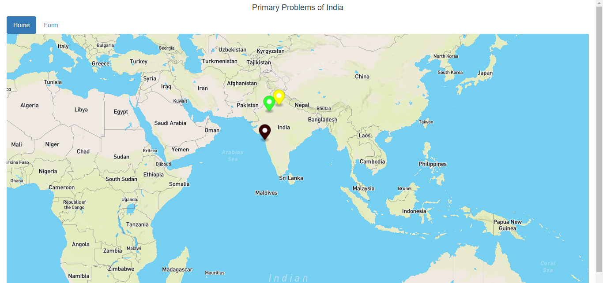

# Primary-Problems-of-India

This project is used to show the problems of India on the Indian map with the help of Mapbox API. In This project, I and my friend manish0pal used PHP to store the information, and to plot that information on the map we used Javascript.
Note - Yellow Mark For - Electricity Problem   Green Mark For - Curruption Problem  Black Mark for - Pollution Problem
You can see the working of the project in http://deepakgupta.epizy.com/Primary%20Problems%20of%20India/?i=1
